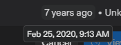
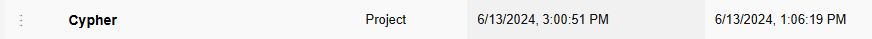

# Hi, I'm Sir Dags 👋

I make a lot of things and forget to post most of them here.

### 💻 Digitally
Full stack dev, game dev, cybersecurity student, voice actor, Live2D animator,
community manager, Steam publisher.

Currently shipping **Two Robots: Unleashed**.

I also spent a semester building VR environments that were too immersive and paid for it in sleep.

### 🔧 Physically
3D printing, wire-wrapped jewelry, welding.
If I can learn how to make it, I will.

### 🎮 Playing
I play everything too. 2D, 3D, VR, card games, you name it.
Playing games and making them aren't that different once you've done both.

---

## 🛠️ Some things I've made

| Project | What it is |
|---|---|
| **Two Robots: Unleashed** | Competitive PvP card game: Godot client, multiplayer backend, Electron desktop client, and an RL agent that learns to play it |
| [AsteroidsPlus](https://github.com/Sir-Dags/AsteroidsPlus) | Classic *Asteroids*, remade in Processing (Java) with levels, shields, power-ups, and sound |
| [CyberProjects_Python](https://github.com/Sir-Dags/CyberProjects_Python) | Password checker and generator. Small security tools, written without AI |
| [Sir-Dags.github.io](https://github.com/Sir-Dags/Sir-Dags.github.io) | My personal site |

**Tools I reach for:** Godot · Python · C++ · Java · JavaScript / Electron · Docker · Live2D

---

## 🕰️ "I forget to post things": the receipts

| Made | Finally on GitHub | Gap | Proof |
|---|---|---|---|
| **Better Than Off Brand Mad Libs** (C#, Replit) | Sep 2026 | **~6.5 years** |  |
| **Random Shit** (Rock Paper Scissors + Tic-Tac-Toe, C++, OnlineGDB) | Sep 2026 | **~3 years** |  |
| **Cypher** (C++, OnlineGDB) | Sep 2026 | **~2 years** |  |
| **This README** | Oct 2026 | **3 years, 1 month** | Created Aug 30, 2023 with just `# About`. You're reading it. |

The rest of the archaeology lives in [Old-Online-Code](https://github.com/Sir-Dags/Old-Online-Code).

---

## 📚 Background
ML research, cybersecurity, and fixing other people's phones for free
because someone had to.

---

I do a lot. Sometimes too much. It keeps moving anyway.
